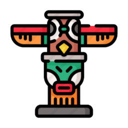

<dl>
    

        
        <h1>Totem</h1>
    

</dl>

	<em>What is Totem?</em>

Totem is a language that is transpiled to C. It is originally written in Java and will implement some interesting features I'd like to see implemented to various other languages. These features are purely subjective and Totem is the result. It is not an optimized language, design-wise might not make a lot of sense, but it's everything I personally feel is missing for most programming languages.

Here is a list of some of the things Totem will be able to do:

 - **Functions returning tuples** - Sometimes it's just more clean to return multiple values at the same time. This can be done by returning a tuple from a function. As a default, single return-type functions are also seen by the transpiler as one-dimensional "tuples". 
 
 - **Object Variables** - These are "final" fields initiated whenever an object is instantiated. Upon creation, it get's default values set which can be accessed throughout the entire class.
 
 - **Tuple Processing** - An experimental idea that performs a certain function on a given tuple.
 
 - **Deep For-Loop** - Creating another layer inside a for loop to allow for multi-variable looping inside one single statement, given by a set of pre-defined behavioral rules.
 
 - **Tilde Operator** - Tilde operator ("~") is capable of rounding off a floating point number towards the specified decimal places.

 - **Easy input** - (This is a requested feature) Easily let a user input a number using "intput()". Credits for this go to Jochen Bernard, who created the [intput](https://github.com/PolyRocketMatt/intput)-package for Python.
 
 - Some more "unique" features might be implemented in the future. As of the current state of totem, these are the features that will almost certainly make it into the language.

	<em>Why should I use it?</em>

You shouldn't. Totem is currently in development and is a side-project. Therefor it is very prone to <em>errors, bugs, performance issues, etc</em>. There is no guarantee for future support. If you feel like contributing, or making this project special, please feel free to contact me or contribute using a PR. 

	<em>Is there documentation?</em>

At the moment, no.

	<em>Acknowledgement</em>

This project started with my curiosity. I wanted to learn how programming languages actually work internally. The process of a basic programming language is thus also the way Totem is processed (lexical analysis, syntactic analysis and finally semantic analysis is done through transpilation to C-code).

The second reason Totem came to be is because of my slapdash decision to create a programming language in the first place. In the end I'm glad I made that decision and I'm proud that I can say that I wrote my very own programming language.

This wouldn't have been possible without the following people/sources, and thus I'd like to thank them here:

-   **[Pinecone](https://www.freecodecamp.org/news/the-programming-language-pipeline-91d3f449c919/)**  - By William W Wold
-   **[Coding Game](https://www.youtube.com/watch?v=dY6jR52fFWo&t=150s)**  - By Sebastian Lague
-   **[Visitor Pattern Tutorial](https://dzone.com/articles/design-patterns-visitor)**  - By James Surge
-   **[Writing a Parser in Java](http://cogitolearning.co.uk/2013/03/writing-a-parser-in-java-introduction/)**  - (Expressions are a pain in the ass!)

---

<dl>
    

        

            Made with ❤ in <b>Leuven</b>.
        

        

            <small>Copyright © 2020 by Matthias Kovacic</small>
        

        

            <small>Icons provided by <a href="https://www.flaticon.com/authors/freepik">Freepik</a> from <a href="https://www.flaticon.com/">Flaticon</a></small>
        

    

</dl>